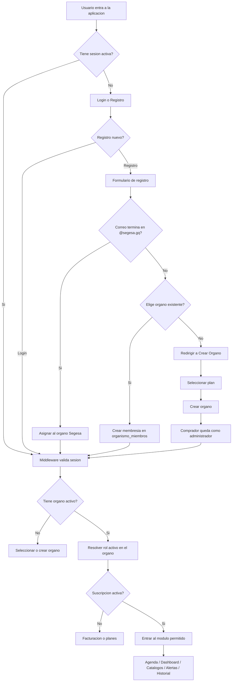
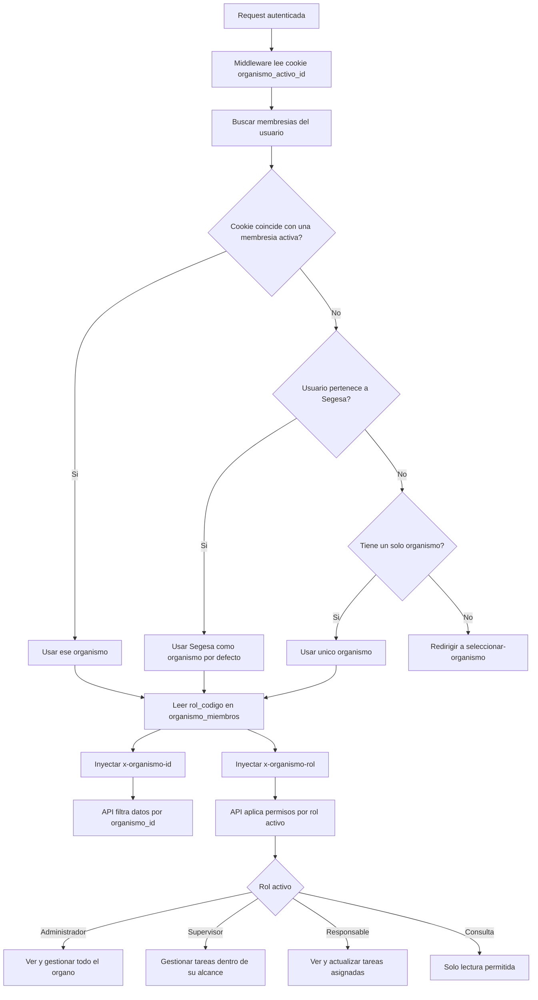
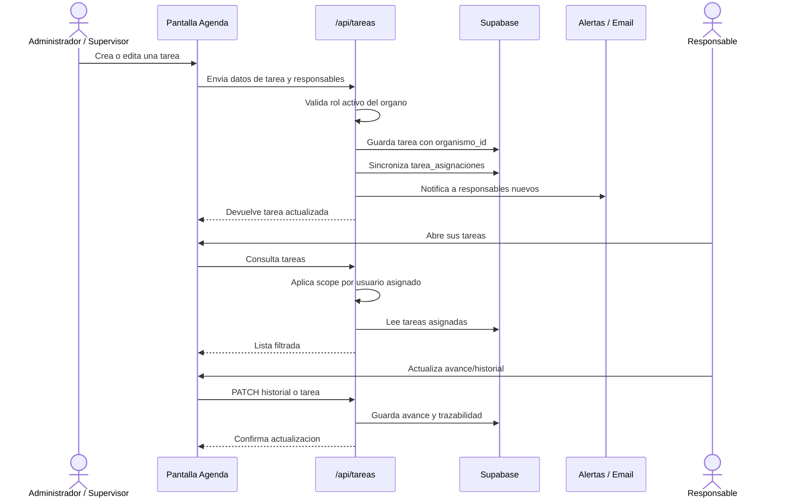
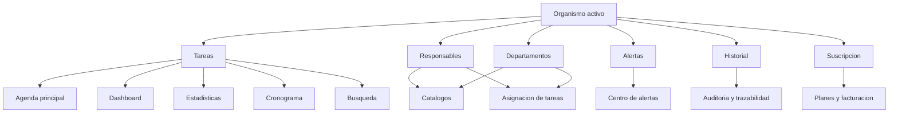
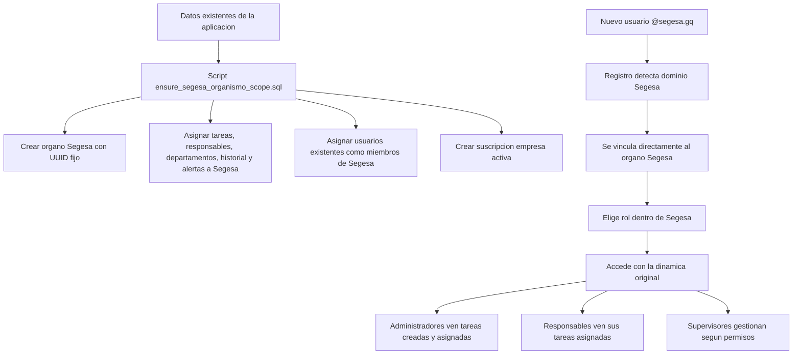

# Diagrama visual del proyecto

Este documento resume el flujo de trabajo de la aplicacion: registro, seleccion o creacion de organo, gestion de tareas, asignaciones, alertas, dashboards y control por roles.

## Flujo principal de usuario



## Arquitectura tecnica

```mermaid
flowchart LR
  subgraph Frontend[Frontend Next.js]
    UI[Paginas y componentes]
    Session[UserSessionProvider]
    Forms[Formularios: Registro, Login, Tareas, Catalogos]
  end

  subgraph Middleware[Middleware]
    Auth[Validar sesion Supabase]
    Org[Resolver organismo activo]
    Role[Resolver rol activo]
    Headers[Inyectar headers internos]
  end

  subgraph API[API Routes]
    Register[/api/register]
    Organismos[/api/organismos]
    Tareas[/api/tareas]
    Catalogos[/api/catalogos]
    Dashboard[/api/dashboard]
    Estadisticas[/api/estadisticas]
    Alertas[/api/alertas]
    Historial[/api/historial]
    Billing[/api/billing/*]
  end

  subgraph Supabase[Supabase]
    AuthDB[auth.users]
    Profiles[perfiles_usuario]
    Orgs[organismos]
    Members[organismo_miembros]
    Subs[organismo_suscripciones]
    Tasks[tareas]
    Assignments[tarea_asignaciones]
    Depts[departamentos]
    Responsables[responsables]
    Alerts[alertas]
    History[historial]
  end

  UI --> Session
  Forms --> API
  UI --> API
  Session --> Middleware

  Middleware --> Auth
  Auth --> Org
  Org --> Role
  Role --> Headers
  Headers --> API

  Register --> AuthDB
  Register --> Profiles
  Register --> Members

  Organismos --> Orgs
  Organismos --> Members
  Organismos --> Subs

  Tareas --> Tasks
  Tareas --> Assignments
  Tareas --> Alerts
  Tareas --> History

  Catalogos --> Depts
  Catalogos --> Responsables
  Dashboard --> Tasks
  Estadisticas --> Tasks
  Alertas --> Alerts
  Historial --> History
  Billing --> Subs
```

## Control de organos, roles y permisos



## Flujo de tareas



## Flujo de datos por modulos



## Estado especial de Segesa



